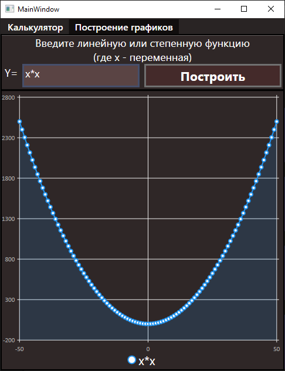

# Калькулятор и построение простых графиков WPF
Данный проект представляет собой простое приложение на платформе WPF, реализующее простой калькулятор,  
а также построение несложных графиков при помощи библиотеки LiveChart.  

* Калькулятор

* Графики

